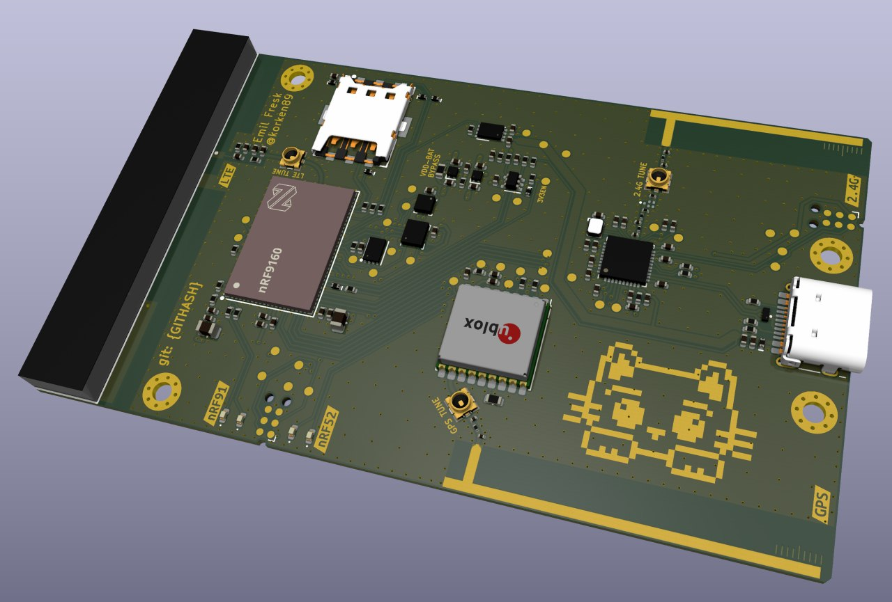
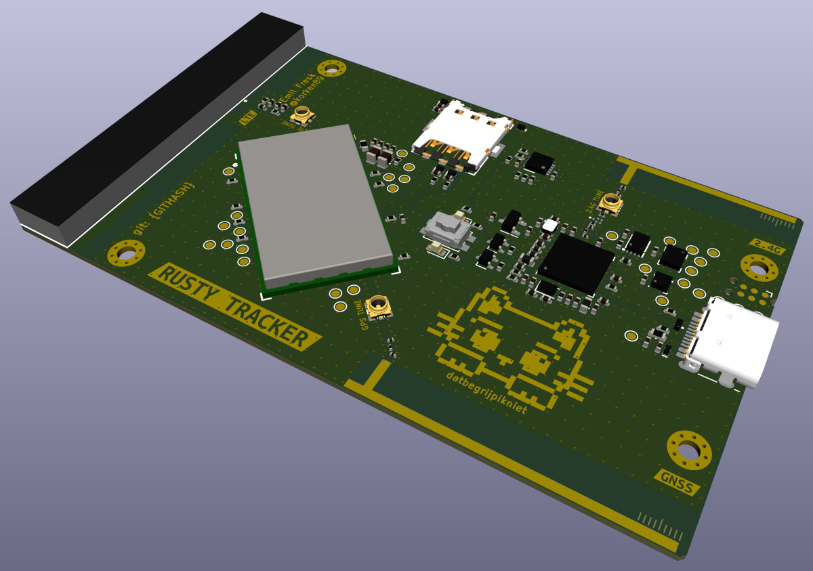

# Rusty Tracker

**A learning board for LTE-M and tracking technologies**

## Versions

There are 2 versions of the board, based on:

1. uBlox R422-M10S
2. nRF9160 + uBlox M10S GNSS

which can be found in the `master` branch and `nrf` branch respectively.

The two IFA antennas are simulated with Ansys HFSS, files are available.

### nRF9160 version

### uBlox R422-M10S version

